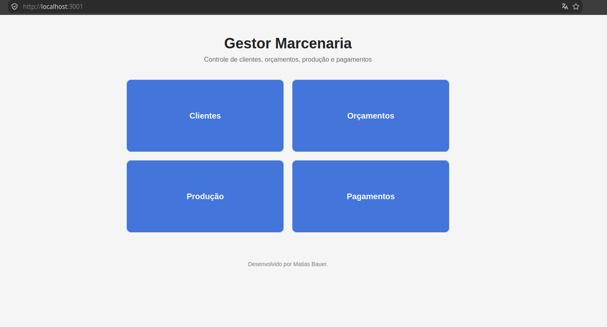

# Gestor Marcenaria

Sistema para gerenciamento de:

- Clientes
- Orçamentos
- Produção
- Pagamentos

## Tecnologias

### Frontend
- React

### Backend
- Node.js
- Express

### Banco de Dados
- SQLite
- Prisma ORM

## Controle de versão
- Git
- GitHub
